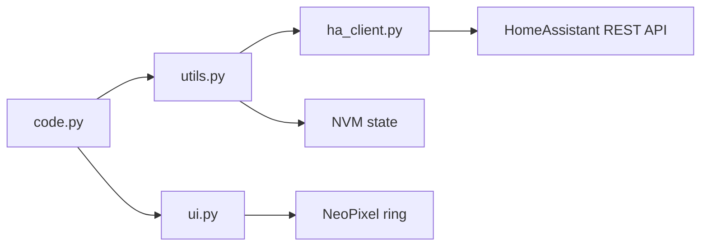

# AGENTS.md

Aspide is CircuitPython firmware for the Adafruit QT Py ESP32-S2 with a STEMMA QT
rotary encoder and NeoPixel ring. It controls Home Assistant scenes and lights
via the HA REST API.

**Runtime:** CircuitPython on device (not desktop CPython).  
**Dev tooling:** Python 3.13+, `uv`, `ruff`, `pre-commit`, `pyright` with
`circuitpython-stubs`.  
**Deployment:** Copy `src/` contents to the `CIRCUITPY` drive; `code.py` is the
entry point.  
**Config:** Device reads env vars from `settings.toml` (local, gitignored).
Template: `src/settings.sample.toml`.

## Commands

```bash
uv sync                                    # install dev deps into .venv
pre-commit run --all-files                 # ruff + ruff-format + markdownlint
ruff check src/ --exclude src/lib/
ruff format src/ --exclude src/lib/
python -m compileall src/code.py           # syntax check only (no on-device run)
pre-commit run --files AGENTS.md           # lint this file
```

There is no pytest suite. Validation is lint, syntax check, and manual device
testing.

## Project structure

| Path | Role |
| --- | --- |
| `src/code.py` | Main event loop: encoder, button gestures, mode routing |
| `src/utils.py` | `ButtonPush`, `RotaryDial` (WiFi, NVM state, mode logic) |
| `src/ha_client.py` | Home Assistant REST client |
| `src/ui.py` | NeoPixel `DisplayManager` |
| `src/colors.py` | Color name parsing, `BRIGHTNESS_PRESETS`, `white_at_brightness()` |
| `src/timeout.py` | Inactivity auto-dim timer |
| `src/lib/` | Vendored CircuitPython libraries (do not lint or refactor) |
| `src/settings.sample.toml` | Config template (commit here, not `settings.toml`) |
| `README.md` | Human-facing docs (update when behavior changes) |



## Domain knowledge

### Modes (`src/utils.py`)

`home_assistant`, `ha_light`, `ha_brightness`

### Config keys (`settings.toml`)

| Key | Purpose |
| --- | --- |
| `HA_SCENES` / `HA_SCENE_COLORS` | Scene mode selection and NeoPixel preview |
| `HA_LIGHT_ENTITY_ID` | Target `light.*` entity for effect and brightness modes |
| `HA_LIGHT_EFFECTS` / `HA_LIGHT_EFFECT_COLORS` | Effect mode list and NeoPixel preview colors |
| `HA_LIGHT_BRIGHTNESS` / `HA_LIGHT_BRIGHTNESS_COLORS` | Brightness preset labels; optional preview override |
| `HA_PHONE_HOME_INTERVAL` (optional) | Seconds between periodic HA connectivity checks; default `DEFAULT_HA_PHONE_HOME_INTERVAL` (300) in `utils.py` |

### Config defaults (0.3.0)

When settings keys are empty, code falls back as follows:

- **`HA_LIGHT_EFFECTS` empty** → `DEFAULT_LIGHT_EFFECTS` in `utils.py` (Warm
  White, Daylight, Sunset, Focus). Does **not** auto-fetch HA `effect_list`.
- **`HA_LIGHT_BRIGHTNESS` empty** → `off`, `low`, `mid`, `high`, `max`
- **Brightness HA values** (`colors.py` `BRIGHTNESS_PRESETS`): off=0, low=64,
  mid=128, high=191, max=255
- **`HA_LIGHT_EFFECT_COLORS` empty** → parsed in `code.py`, passed to
  `DisplayManager`; UI falls back to `colorwheel()` per effect index (not
  `DEFAULT_LIGHT_EFFECT_COLORS` in `utils.py`, which is currently unused)
- **`HA_LIGHT_BRIGHTNESS_COLORS` empty** → NeoPixel preview scales white via
  `white_at_brightness()` to match each preset's HA brightness
- **`HA_PHONE_HOME_INTERVAL` absent** → `DEFAULT_HA_PHONE_HOME_INTERVAL` (300 s)
- **Invalid or non-positive `HA_PHONE_HOME_INTERVAL`** → serial log warning, fall back to
  `DEFAULT_HA_PHONE_HOME_INTERVAL`
  in `utils.py`; `code.py` gates `RotaryDial.phone_home_assistant()` on
  `time.monotonic_ns()`

### Controls (`src/code.py`)

- **Rotate:** browse selection (preview only for light effects and brightness)
- **Single push:** activate current selection (scene, effect, or brightness)
- **Long push:** cycle mode (`mode_next()`), apply effect/brightness if needed
- **Double push:** reboot after NVM save (`microcontroller.reset()`)

### State persistence

`RotaryDial.save_state()` persists indices to `microcontroller.nvm` with magic
byte `0x43` (`NVM_MAGIC`):

- `[0]`: magic byte
- `[1]`: mode ID
- `[2]`: HA scene index
- `[3]`: HA light effect index
- `[4]`: HA brightness preset index

## Code style

- Match existing style: module docstrings, class docstrings with Args/Returns,
  `snake_case` functions, private members as `__name`.
- Keep changes minimal and localized; extend existing classes rather than
  re-architecting.
- CircuitPython constraints: limited RAM, no full stdlib; avoid heavy abstractions
  or new dependencies without approval.
- Ruff applies to `src/` excluding `src/lib/`.

```python
# Good: route by current mode in the main loop
curr_mode = rotary_dial.mode_current()
if curr_mode == "ha_light":
    rotary_dial.ha_light_apply_effect()
elif curr_mode == "ha_brightness":
    rotary_dial.ha_brightness_apply()

# Bad: invent parallel gesture handlers or duplicate mode lists
MODES = ["scenes", "lights", "brightness"]  # diverges from RotaryDial.__modes
```

## Testing and validation

1. Run `pre-commit run --all-files` before finishing.
2. Run `python -m compileall` on touched Python files.
3. For behavior changes, verify on device: rotate, single/long/double push, WiFi
   reconnect, HA API calls, periodic HA phone-home check and reboot-on-failure.
4. Do not add trivial tests unless explicitly requested.

## Security and boundaries

### Always

- Update `src/settings.sample.toml` when adding new config keys.
- Update `README.md` when user-facing controls or modes change.
- Run pre-commit before commit.

### Ask first

- Adding `pyproject.toml` dependencies (impacts device library bundling).
- Changing NVM layout or magic bytes (breaks persisted state).
- Modifying `src/lib/` vendored code.
- Deleting assets or large binary files.

### Never

- Commit `src/settings.toml` (gitignored; contains WiFi password and HA token).
- Hardcode secrets, tokens, or LAN IPs in source.
- Refactor unrelated code in the same change.
- Commit unless explicitly asked.

## Git workflow

- Use feature branches (e.g. `feat/generic_light`).
- Pre-commit enforces ruff and markdownlint.
- Commit messages: concise, focus on why (`fix:`, `chore:`, or a short sentence).
- Remote is Gitea (`git.priv.os76.xyz`); do not force-push `main`.
