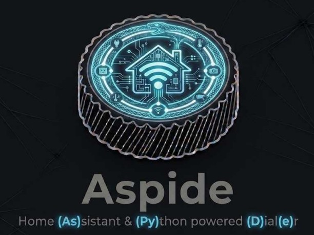
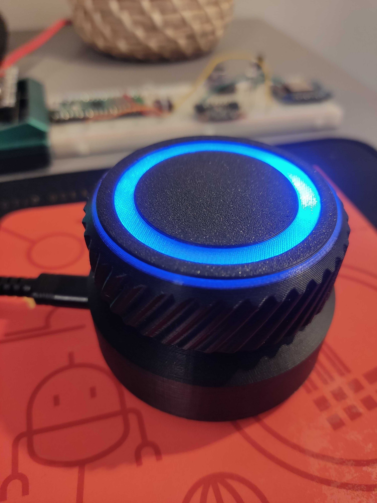
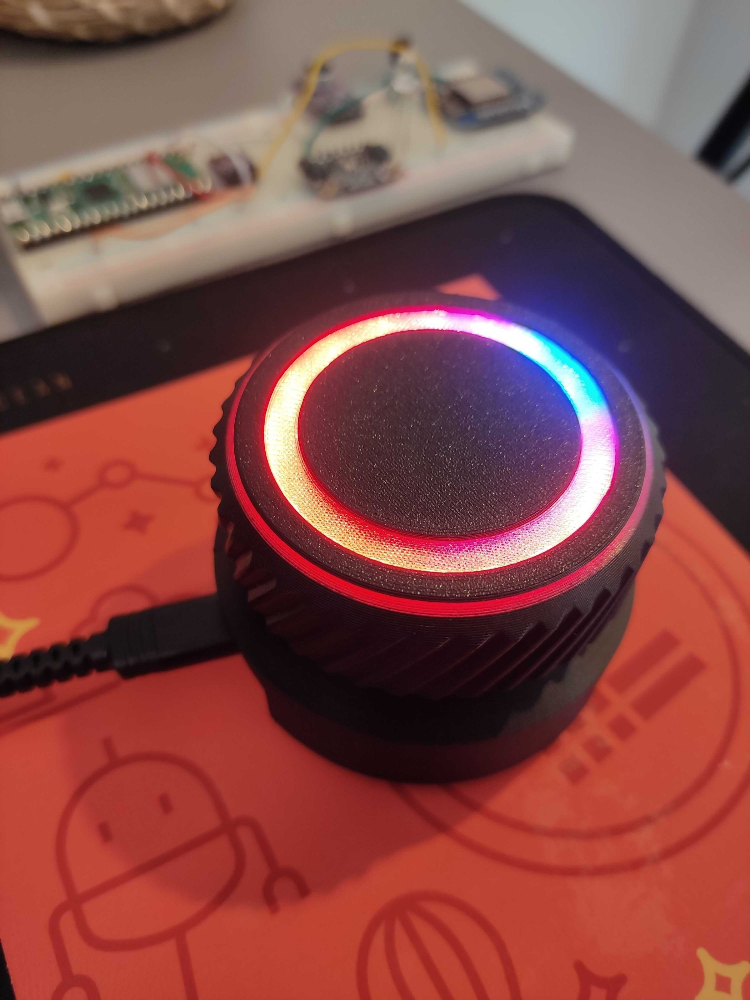
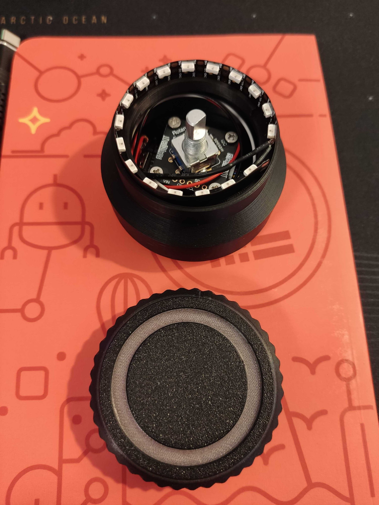
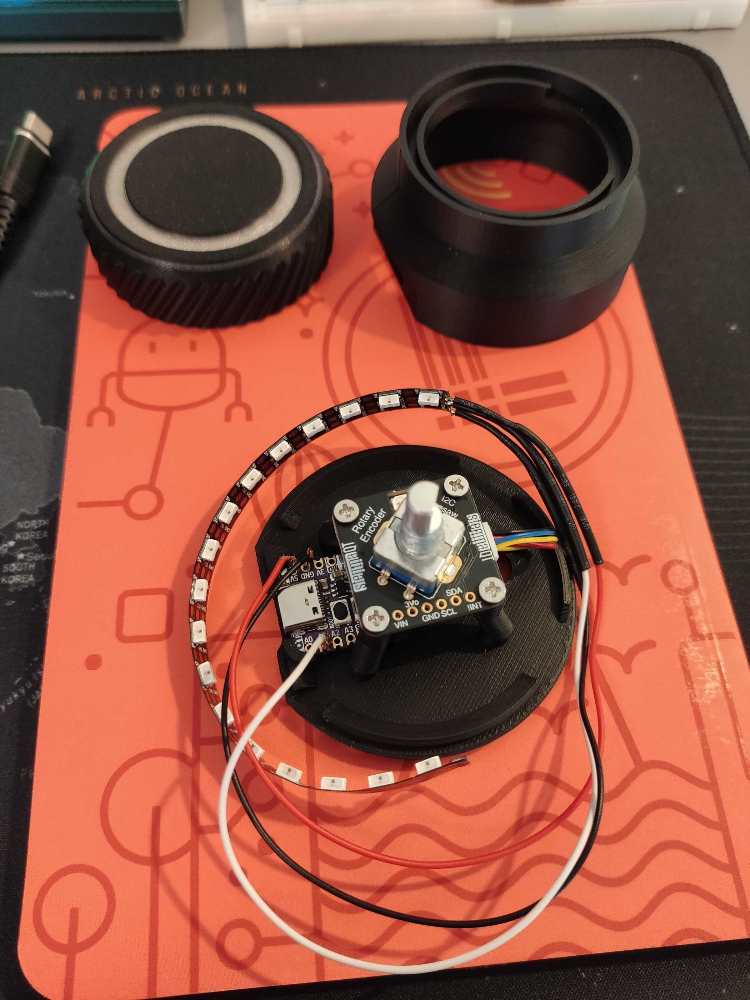
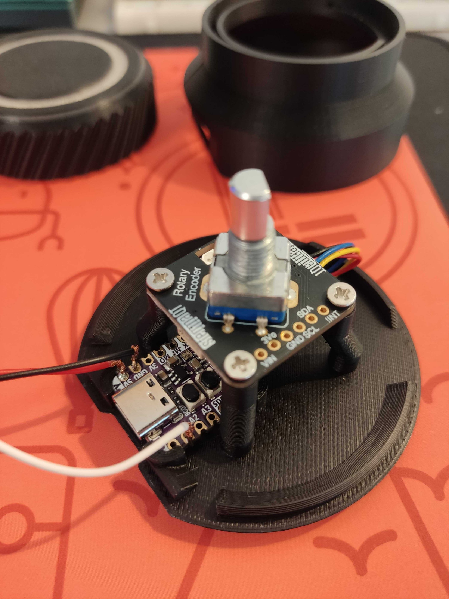
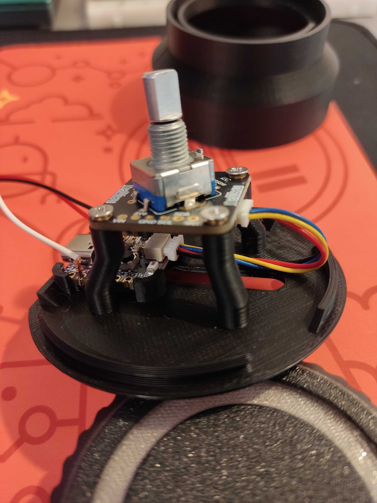
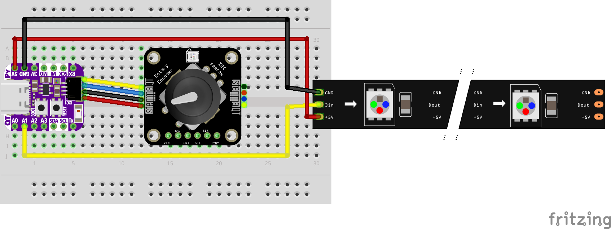

# Aspide

<p align="center">
    
</p>

**Aspide** is a smart, tactile, rotary controller built with
[CircuitPython](https://circuitpython.org/) for the Adafruit QT Py ESP32-S2
board.\
This device provides a physical interface to control
[Home Assistant](https://www.home-assistant.io/) scenes and lights
with rich visual feedback via a NeoPixel strip.

**Aspide** is inspired by two of the many, great, tutorials created by
[Adafruit](https://www.adafruit.com/):

- [USB Rotary Media Dial](https://learn.adafruit.com/usb-rotary-media-dial)
- [Control Wiz Lights With CircuitPython](https://learn.adafruit.com/control-wiz-lights-with-circuitpython/overview)

## Features

- **Triple Control Modes**: Switch between controlling _Home Assistant scenes_,
  _light effects_, and _brightness presets_.
- **NeoPixel Visual Feedback**:
  - Mode indicators (Blue for scenes, Amber for effects, White for brightness).
  - Scene/Effect/Brightness previews with colors matching the selected setting.
- **Home Assistant Integration**: Uses the HA REST API for reliable, low-latency
  control.
- **Manufacturer-Agnostic Light Control**: Controls any HA `light.*` entity
  through Home Assistant — no direct UDP or vendor-specific libraries required.
- **Inactivity Timer**: Automatically dims NeoPixels after a period of
  inactivity to save power and reduce light pollution.

## Screenshots

<details>
    <p align="center">
        
        
        
        
        
        
    </p>
</details>

## Hardware Requirements

- **Microcontroller**:
  [Adafruit QT Py ESP32-S2 WiFi Dev Board with STEMMA QT](https://www.adafruit.com/product/5325)
- **Input**:
  [Adafruit I2C Stemma QT Rotary Encoder Breakout with Encoder - STEMMA QT / Qwiic](https://www.adafruit.com/product/5880)
- **Output**:
  [Adafruit NeoPixel LED Side Light Strip](https://www.adafruit.com/product/3634)
- **STEMMA cable**:
  [STEMMA QT / Qwiic JST SH 4-Pin Cable](https://www.adafruit.com/product/4399)
- **USB cable**:
  [USB A to USB C Cable](https://www.amazon.de/dp/B0D72YLKWL?ref=ppx_yo2ov_dt_b_fed_asin_title&th=1)
- **Power cable**:
  [Stranded-Core Ribbon Cable - 4 Wires](https://www.adafruit.com/product/3891)
  or 3 single cables (stranded)
- **Enclosure**:
  [3D printed case](https://learn.adafruit.com/usb-rotary-media-dial/cad-files)
  for the
  [USB Rotary Media Dial](https://learn.adafruit.com/usb-rotary-media-dial)
- **Enclosure Screws**:
  [4 M2.5 x 6mm steel machine screws](https://www.amazon.de/-/en/dp/B01D4R5A1E?ref=ppx_yo2ov_dt_b_fed_asin_title)

### Cabling

<details>

<p align="center">
    
</p>

</details>

## Configuration

The device is configured via a `settings.toml` file located in the root of the
`CIRCUITPY` drive.

### WiFi Settings

```toml
CIRCUITPY_WIFI_SSID = "Your_SSID"
CIRCUITPY_WIFI_PASSWORD = "Your_Password"
```

### Home Assistant Settings

To connect to Home Assistant, you need your server URL and a **Long-Lived Access
Token** (generated from your HA user profile).

```toml
HA_URL = "http://192.168.1.78:8123"
HA_TOKEN = "your_long_lived_access_token_here"

# List of HA scenes to iterate through in 'home_assistant' mode
HA_SCENES = "scene.nightlights,scene.lightsoff,scene.redalert,scene.softlights1"

# Light entity for ha_light and ha_brightness modes
HA_LIGHT_ENTITY_ID = "light.wiz_01"

# Effects to browse in ha_light mode (comma-separated, must match HA effect_list)
# Leave empty to auto-fetch effect_list from HA at boot
HA_LIGHT_EFFECTS = "Ocean,Sunset,Party,Candlelight"

# NeoPixel preview colors for effects (1:1 with HA_LIGHT_EFFECTS; optional)
HA_LIGHT_EFFECT_COLORS = "dim_blue,bright_orange,bright_purple,soft_gold"

# Brightness presets for ha_brightness mode (dim=26, soft=102, bright=255)
HA_LIGHT_BRIGHTNESS = "dim,soft,bright"
HA_LIGHT_BRIGHTNESS_COLORS = "dim_white,soft_white,bright_white"
```

### NeoPixel Customization

Customize the behavior and appearance of the LED ring.

```toml
# Seconds of inactivity before NeoPixels turn off
NEOPIXEL_TIMEOUT = 30

# Colors for HA scenes (maps 1-to-1 with HA_SCENES above)
# Available intensities: bright_, soft_, dim_
# Available colors: white, green, red, blue, purple, cyan, yellow, orange, pink, gold, black
HA_SCENE_COLORS = "dim_blue,black,bright_red,soft_white"
```

## Operation

### Controls

- **Rotate**: Browse through the available scenes, effects, or brightness
  presets. The NeoPixel ring will change color to provide a preview.
- **Single Push**: Activate the currently selected scene, effect, or brightness
  preset.
- **Double Push**: Perform a hard reset of the device (reboots and reconnects to
  WiFi).
- **Long Push**: Cycle through **Home Assistant Mode** (Blue), **Light Effects
  Mode** (Amber), and **Brightness Mode** (White).

### Modes

1. **Home Assistant Mode**: Cycles through the scenes defined in `HA_SCENES`.
   The NeoPixels will match the colors defined in `HA_SCENE_COLORS`.
2. **Light Effects Mode** (`ha_light`): Cycles through effects defined in
   `HA_LIGHT_EFFECTS`, or auto-fetches `effect_list` from HA when empty. Effect
   names must match what your light integration exposes. NeoPixel preview colors
   come from `HA_LIGHT_EFFECT_COLORS`.
3. **Brightness Mode** (`ha_brightness`): Cycles through presets in
   `HA_LIGHT_BRIGHTNESS` (default: dim, soft, bright). Single push sends
   `light.turn_on` with the corresponding brightness level. NeoPixel preview
   colors come from `HA_LIGHT_BRIGHTNESS_COLORS`.

## Installation

1. [Install CircuitPython on your QT Py ESP32-S2](https://learn.adafruit.com/adafruit-qt-py-esp32-s2/circuitpython)
2. Copy the contents of the `src/` directory to the root of your `CIRCUITPY`
   drive
3. Make sure all the required libraries have been copied int the `lib/` folder
4. Use `settings.sample.toml` as template to configure your `settings.toml`
5. Enjoy!
